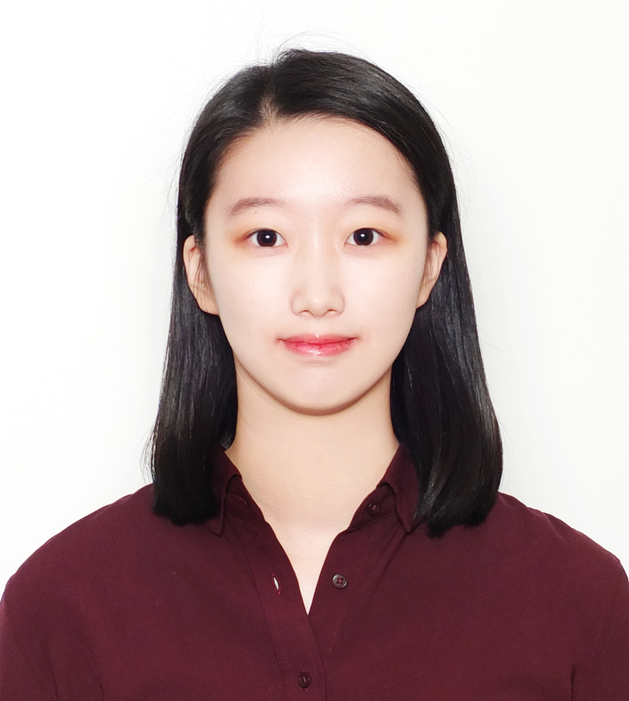

# 김다연/yeondelight

**Simple is the Best!**

간단하지만 견고한 프로그램을 지향하는 개발자

끝없는 발전을 지향하는 개발자

모두와 함께 나아가는 개발자

### 1.인적사항(Personal Information)

**이름:** 김다연(Dayeon, Kim)

**생년월일:** 00.04.07

      

### 2.학력 사항(Education)

| 입학년월 | 졸업년월 |      출신 학교    |     전공     |  평균/평점|
| -------- | -------- | ----------------- | ------------ | --------- |
|  2016.3  |  2019.2  | 여의도여자고등학교|    이공계    |  0.0/0.0  |
|  2019.2  |  재학중  | 한성대학교        | 컴퓨터공학부 |  4.3/4.5  |

3.1 기초지식(Basics)

- Programming Languages: C, C++, Java, HTML, Javascript, Python
- Operating Systems: Windows, Linux
- Micro controllers: Raspberry Pi
- IDE(Eclipse, Visual Studio)

3.2 웹 개발(Web Development)

- Server(Apache web server, AWS)

3.3 소프트웨어 도구(Software Tools)

- 소스코드관리(**Git**)

3.4 학부 수강 과목(Course)

- ( 언어 ) C(컴퓨터 프로그래밍, 프로그래밍랩), C++(객체지향언어1), JAVA(객체지향언어2), Python(모바일&스마트 시스템)
- ( 통신 ) 데이터통신
- ( 이론 ) 자료구조, 알고리즘, 컴퓨터구조, 프로그래밍언어론
- ( 웹 ) HTML, CSS, Javascript(웹프로그래밍기초, 웹프로그래밍)
- ( 수학 ) 확률과 통계, 선형대수
- ( 형상관리도구 ) Git(오픈소스소프트웨어)
- ( 기타 ) 

### 3.어학 및 자격증(Certificate)

|    자격증명   |  발급일자  |    발급기관   |   비고  |
| ------------- | ---------- | ------------- | ------- |
| ITQ OA Master | 2020.12.01 | 한국생산성본부| 발급예정|
| GTQ 1급       | 2012.12.14 | 한국생산성본부|         |

### 4.수상 및 경력(Awards & Career)

|        수상명         |  수상일자 |     기관     |
| --------------------- | --------- | ------------ |
| 성적우수장학금 총 3회 | 2019-2020 |  한성대학교  |

### 5.프로젝트(Projects)

| 경력 구분     | 활동 내용                  | 기관   | 활동기간          |
| ------------- | -------------------------- | ------ | ----------------- |
|               |                            |        |                   |

### 6.연락처(Contact)

github: https://github.com/yeondelight 
email: hihi5v@naver.com
