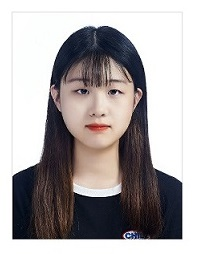

# 배유진/BaeYuJin
모바일 앱에 관심있는 개발자  
개발 시, 테스트를 쉴 새 없이 해보는 개발자  
팀원과의 협업을 통해 서로 도우며 함께 소통하는 개발자

**1. 인적사항(Personal Information)**

**이름**: 배유진 (Yujin, Bae)  
**생년월일:** 99.04.17  

**2. 학력 사항(Education)**

| 입학년월 | 졸업년월 | 출신 학교 | 전공 | 평균/평점 |
|:----------:|:---------:|:----------:|:----------:|:----------:|
| 2019.2 | 2023.2	| 한성대학교	| 컴퓨터공학부 | 4.1/4.5 |

**3. 보유기술(Technical Skills)** 

3.1 기초지식(Basics)

* Programming Languages: C, C++, Java, Html, CSS, Javascript, Node.js, Python
* Operating Systems: Linux, Unix
* IDE(Eclipse)

3.2 소프트웨어 도구(Software Tools)

* 소스코드관리(Git)

3.3 학부 수강 과목(Course)
* ( 언어 ) 컴퓨터프로그래밍(C), 객체지향언어1(C++), 객체지향언어2(JAVA), 문제해결을 위한 코딩 첫 걸음(Python)
* ( 통신 ) 데이터통신
* ( 이론 ) 자료구조, 알고리즘, 컴퓨터구조, 프로그래밍언어론
* ( IPP Internship course ) 오픈소스소프트웨어
* ( 웹 ) 웹 프로그래밍 기초(Html, Css, JavaScript), 웹프로그래밍(Html, Css, Javascript, Node.js)
* ( 수학 ) 확률및통계
* ( 데이터기반 ) 빅데이터 기초
* ( 기타 ) 모바일&스마트시스템

**4. 어학 및 자격증(Certificate)**

| 자격증명 | 발급일자 | 발급기관 |
|:----------:|:----------:|:----------:|
| 워드프로세서 3급 | 2010.03.12 | 대한상공회의소 |

**5. 수상 및 경력(Awards & Career)**

| 수상명 | 수상일자 | 기관 |
|:----------------:|:----------------:|:----------------:|
| 용인리빙랩 영상공모전 장려상 | 2020.08.15 | 용인시디지털산업진흥원 |
| 성적우수 장학금 총 2회 | 2019-2, 2020-1 | 한성대학교 |

|아르바이트 경력 |	활동 내용 |	기관 | 활동기간 |
|:----------------:|:----------------:|:----------------:|:----------------:|
|아인스수학위싱웰영어학원|보조교사|용인시 기흥구|2017.12~2018.02|
|맘스터치|서비스업종|영통역점|2018.07|
|CU|서비스업종|영통으뜸점, 원천주공점|2018.11~2019.08|
|베스트올|서비스업종|기흥역점|2020.02~2018.05|

**6. 프로젝트(Projects)**

* 모바일&스마트시스템 라즈베리파이를 이용한 부엌모니터링시스템
* 객체지향언어2 자바 GUI를 이용한 bearfish게임

**7. 연락처(Contact)**

github: https://github.com/BaeYuJin  
email: star_0417@naver.com
