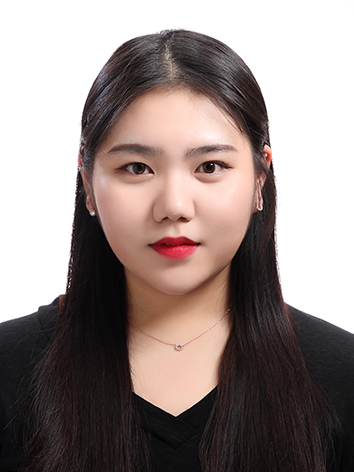

# 이지아 / Lee JIA

늘 새로운 마음으로 배우며 성장하는 개발자

팀원들과 소통하며 함께 나아가는 개발자

기획과 개발 능력을 모두 갖춘 개발자

### 1. 인적사항(Personal Information)  

 이름 : 이지아 (Lee JiA)

 생년월일 : 98.11.05
 
 
 

### 2. 학력 사항(Education)

| 입학년월 | 졸업년월 | 출신 학교  |     전공     | 평균/평점 |
| :------- | :------: | :--------: | :----------: | :-------: |
| 2017.2   |  2021.8  | 한성대학교 | 컴퓨터공학부 | 3.73/4.5  |

### 3. 보유기술(Technical Skills)

1. 기초지식(Basics)
   * Programming Languages: C, C++, __Java__, __Javascript__, R, Python
   * Operating Systems: Linux, Windows
   * IDE(Eclipse, IntelliJ)
2. 웹 개발(Web Development)
   * Java 개발 프레임워크(__MVC__, __Spring__)
   * DB 응용 개발(**Oracle**, __Mysql__)
   * Server(Apache web server, Tomcat, **AWS**)
3. 소프트웨어 도구(Software Tools)
   * 소스코드관리(__Git__), 클라우드 컴퓨팅(AWS, Azure, IBM)
   * 빌드도구(Maven, Gradle)
4. 학부 수강 과목(Course)
   * ( 언어 ) C(컴프), C++(객체지향언어1), JAVA(객체지향언어2), R(데이터마이닝), Python(파이썬 기초) 
   * ( 통신 ) 데이터통신, 네트워크 프로그래밍 
   * ( 이론 ) 자료구조, 컴퓨터구조, 프로그래밍언어론, 설계패턴
   * ( DB ) 데이터베이스, 데이터베이스 설계
   * ( OS ) 운영체제(Unix), 시스템프로그래밍(Linux)
   * ( 웹 ) 웹 프로그래밍(Html, Css, JavaScript), 서버프로그래밍(**Spring**)
   * ( 데이터기반 ) 데이터 마이닝, 빅데이터프로그래밍
   * ( 설계 ) 캡스톤디자인

### 4. 어학 및 자격증(Certificate)

| 자격증명 | 발급일자 | 발급기관 |
| -------- | -------- | -------- |
|          |          |          |

### 5. 수상 및 경력(Awards & Career)

| 수상명                               | 수상일자   | 기관       |
| ------------------------------------ | ---------- | ---------- |
| 한성대학교 공학경진대회 - 장려상     | 2019.09.27 | 한성대학교 |
| 한성대학교 공학경진대회 - 후원업체상 | 2019.09.27 | 한성대학교 |

| 경력 구분                   | 활동 내용                | 기관                | 활동 기간       |
| --------------------------- | ------------------------ | ------------------- | --------------- |
| 학생회                      | 학생회 부원              | 한성대학교          | 2017~2019       |
| 모교후배를 위한멘토링       | 고 1 수학 멘토링         | 광문고등학교        | 2017.03~2017.12 |
| 학과전공튜터링              | 웹프로그래밍 멘토        | 한성대학교          | 2018.03~2018.06 |
| 학과전공튜터링              | 프로그래밍랩 멘토        | 한성대학교          | 2018.09~2018.12 |
| 대학생교육봉사단            | 교육기부활동(초,중,고)   | 한국과학창의재단    | 2017~2018       |
| H.U.V(한성대학교사회봉사단) | 지역아동센터봉사(중, 고) | 동소문 지역아동센터 | 2018~2019       |
| 공학경진대회                | 스마트미러(DB서버 구축)  | 한성대학교          | 2019.06~2019.09 |
| 학과전공튜터링              | 웹프로그래밍 멘토        | 한성대학교          | 2020.03~2020.07 |
| 캡스톤디자인                | Cafe-in (웹서버, DB)     | 한성대학교          | 2020.01~2020.07 |

### 6. 프로젝트(Projects)

| 경력 구분    | 활동 내용  | 기관       | 활동 기간       |
| ------------ | ---------- | ---------- | --------------- |
| 공학경진대회 | 스마트미러 | 한성대학교 | 2019.06~2019.09 |
| 캡스톤디자인 | cafe-in    | 한성대학교 | 2020.01~2020.07 |

### 7. 연락처(Contact)

github : https://github.com/JIA98

email: wldk1105@naver.com

